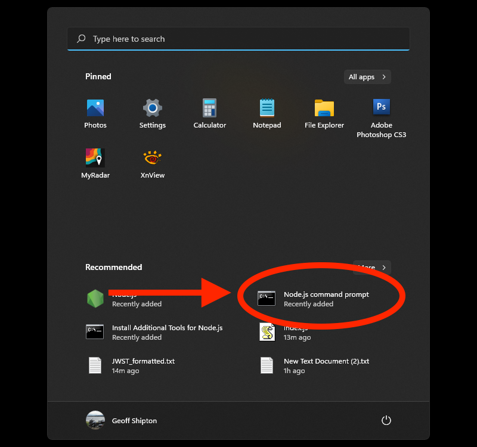

# JWST formatter

Quick script to reformat some data for the JWST to use here: https://github.com/nbhasker/JWSTStellarium

Needs proper error handling and some other things.

Here's how to run it (Windows)

1. Open the Node.js command prompt (shortcut in the Windows menu)



2. Navigate to the JWST directory in the D: drive

```bash
cd /D 
cd path/to/JWST/folder
```

3. Drag the CSV file you want to reformat into the JSWT folder 

4. Make sure the filename in the last line of code in `index.js` matches the name of the CSV file you want to reformat.

```javascript
fs.createReadStream(__dirname+'/THIS MUST MATCH INPUT FILENAME.csv').pipe(parser);
```

5. By default, the output file will be named 'JWST_formatted.txt'. If you want to name it something different, you can change the name of the file by modifying the filename in the `reformattedFilename` variable.

```javascript
const reformattedFilename = 'CHANGE THIS TO CHANGE THE OUTPUT FILENAME.txt'
```

6. In the Command Prompt, run the following command:

```bash
node index.js
```

7. You should see a lot of "Wrote record" lines in the Command Prompt, and a new file will be created with the name you gave it.